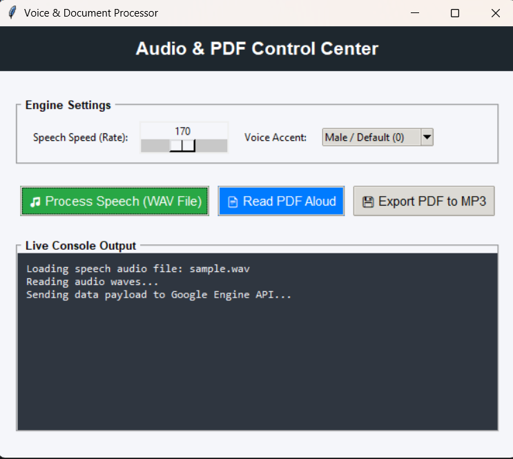

# Audio & PDF Control Center

A versatile Python desktop application (GUI) and command-line utility that converts PDF documents into spoken audio and transcribes spoken WAV files into text using Google Speech Recognition. 

---

## User Interface

---

## Features

* **Interactive GUI Control**: Use an intuitive window interface with speed sliders, accent drop-down menus, and a live tracking console log.
* **PDF Aloud Reader**: Uses `pypdf` to accurately extract text from documents and parse them into clean, fluent speech streams.
* **Audiobook Generation**: Export your multi-page PDFs directly to offline high-quality `.mp3` files for portable listening.
* **Speech-to-Text (WAV Conversion)**: Pass local audio recording paths to instantly decode spoke text words via Google's free API cloud gateway.
* **Formatting Cleanup**: Automatically filters out messy layout whitespaces and raw inline newline breaks for natural punctuation parsing.
